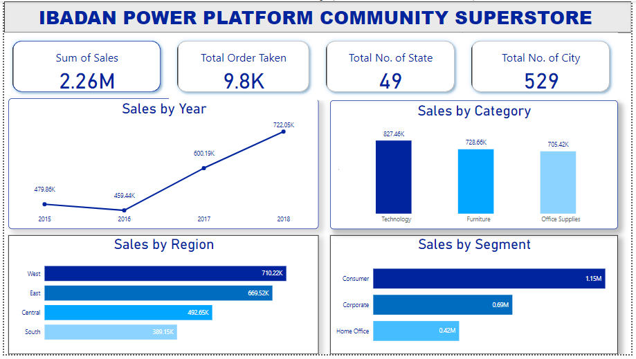
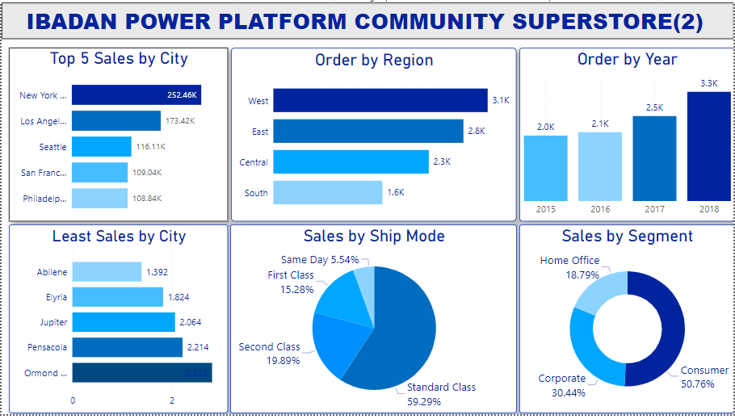
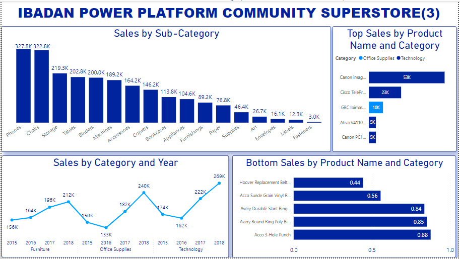

# SUPER STORE ANALYSIS
Greetings fellow data Colleagues!

Embarking on a five-week journey with the **IBADAN POWER PLATFORM COMMUNITY** has been an enriching experience, culminating in a real-world application of our newfound Power BI skills. The community generously provided us with a dataset, challenging us to unleash the potential of data analytics and draw meaningful insights.
## SuperStore Analysis

## Introduction
The provided dataset was given to us by the **Ibadan Power Platform Community.** The dataset encompasses crucial information such as order details, customer demographics, product specifics, and sales data. This project serves as the culmination of our training, allowing us to practically apply our newfound knowledge and create tangible, data-driven insights.

## Problem Statement
1. What is the total sales made yearly since 2015? Has sales been on the increase since over the years?
2. Which of the segments, categories and regions make the highest sales?
3. Where does our Customers reside?
4. In which year do we have the highest and least order? etc.

## Data Sourcing
Upon formulating the aforementioned questions, the next step involved procuring the requisite dataset for analysis. Utilizing the provided problem statement as a guideline, I obtained the dataset from the Ibadan Power Platform Community. This dataset, meticulously prepared and shared by the community, encapsulates pivotal information encompassing order details, customer demographics, product specifics, and sales data.

To commence the data sourcing process, I navigated to the designated source and downloaded the dataset in CSV format. Following this, I extracted the CSV file into Power BI, a robust data analysis and visualization tool. This facilitated seamless integration of the dataset into a dynamic analytical environment, enabling comprehensive exploration and interrogation of the data.

## Data Transformation/Cleaning
The Data was pre-efficiently cleaned. I did no data cleaning.

## Data Modeling
The dataset contains only a table, So, No modeling is needed

## Data Analysis and Visualization.

From the Dashboard, It is observed that 
1. The sum of sales from 2015 - 2018 = **$2.26 Million**
2. The total order Taken from 2015 -2018 = 9.8K.
3. The Sales was made from 49 States across 529 cities in the United State of America.
4. From 2015, The store has a decrease in 2016 sales, and since then there have been increases in 2017 and 2018 respectively
5. The best selling region across all the years is **Western Region** and worst selling region across all the years is **Southern Region**
6. The best selling segment is **Consumer segment** and the worst selling segment is **Home segment office**
##

##

From this 2nd Dashboard, It is observed that
1. The highest Sales came from **New York** and **Los Angeles** city while the least sales came from **Abilene**
2. The highest order taken across all the years is from **Western Region** and least order taken across all the years is **Southern Region**
3. The most preferred ship mode by the customer is the **Standard Ship"
##

From the 3rd Dashboard,
1. We can see the sales by sub category
2. Sale by category and year etc. 
##

##

